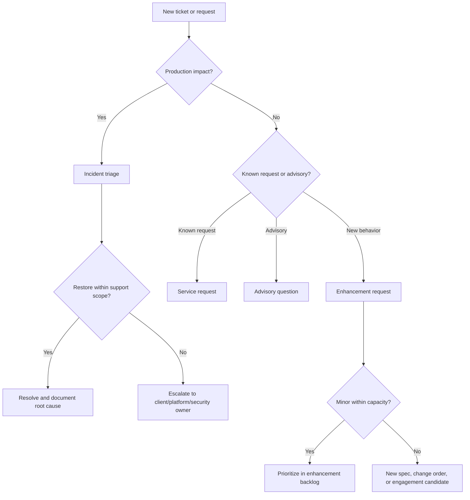

# Playbook: Ops Continuity

> **Version**: 1.0 | **Last Updated**: 2026-05-28

## Overview

**What this project type involves**: Creating a reusable post-delivery operating model for AIS-delivered solutions. The model covers support tiers, operational signal baselines, ticket/request flow, enhancement intake, advisory reachback, reporting cadence, and project-to-operations handoff.

**Typical client profile**: Clients moving from delivery, hypercare, or pilot adoption into ongoing production support. The client may need Tier 2 application support, L2 production support, governed enhancements, platform operations reachback, onboarding help, or a small retainer that keeps AIS available without creating a full managed services program.

**What success looks like**: The account can explain what AIS will support, how work enters the queue, how incidents differ from requests and enhancements, when work escalates into a new spec or commercial action, and what minimum operational evidence must exist before delivery becomes support.

**Existing-project baseline**: When this playbook starts from an existing delivered product, pilot, or client environment, the first ops output should establish the starting baseline for supported product areas, environments, access paths, operational signals, runbooks, known defects, deferred enhancements, and open handoff gaps. Treat unknowns as explicit gaps rather than assumed support scope.

---

## When to Use This Playbook

Use this playbook when sources mention any of these signals:

- post-delivery support, hypercare extension, production support, Tier 2, L2, managed application support, or "keep the lights on"
- bug fixes, defect remediation, enhancement backlog, minor enhancements, or feature requests after launch
- advisory reachback, SME support, governance support, platform operations, onboarding support, or client enablement
- ticketing through ServiceNow, Jira, Azure DevOps, GitHub, Teams, email, or another client-owned queue
- retainer tiers, named monthly hours, scale up/down with notice, offshore delivery options, or managed capacity
- need for HubSpot follow-on summary text

Do not use this playbook to invent a support commitment. If the source only names a candidate account or product, create an ops intake assessment and keep the support model TBD.

---

## Service Taxonomy

Use this taxonomy before tiering or SOW language. It prevents every post-delivery ask from becoming either a defect or a new project.

| Category | Definition | Typical Handling | Boundary |
| --- | --- | --- | --- |
| Incident | Production-impacting interruption, degradation, failed job, security event, or data integrity issue | Triage, restore service, capture root cause, log follow-up work | Does not include new capability beyond restoration |
| Service request | Access, configuration, data refresh, deployment help, runbook task, onboarding support, or standard operational change | Fulfill through documented request flow and approval path | Repeated requests may become automation or backlog work |
| Advisory question | Time-bounded SME reachback, architecture guidance, governance question, or operational decision support | Answer within tier cadence; document recommendation and assumptions | Extended analysis becomes enhancement, change order, or new engagement |
| Enhancement request | New behavior, workflow change, integration, report, automation, model/prompt update, or UX improvement | Triage into enhancement backlog with estimate, priority, acceptance criteria, and commercial path | Minor items may fit tier capacity; material work becomes new spec/change order |
| New engagement candidate | Work that changes outcomes, users, systems, compliance posture, commercial model, or delivery team shape | Create discovery item, proposal/SOW path, or delivery spec seed | Do not absorb into support capacity silently |

---

## Discovery Questions

### Account and Commercial Context

| # | Question | Phase |
| --- | --- | --- |
| 1 | What solution, platform, or workstream is moving from delivery into support? | Pre-sales |
| 2 | Is the ask bug-fix support, production operations, enhancements, advisory reachback, onboarding, or a mix? | Pre-sales |
| 3 | What period of performance, renewal cycle, retainer window, or notice period is expected? | Pre-sales |
| 4 | Is the client buying outcomes, named capacity, a response posture, or a ticket queue? | Pre-sales |
| 5 | What budget posture is known: small retainer, fixed capacity, variable capacity, or unknown? | Pre-sales |
| 6 | What makes support work commercially separate from a change order or new engagement? | Pre-sales / Scope |

### Operating Model

| # | Question | Phase |
| --- | --- | --- |
| 1 | Who owns Tier 1/client intake before AIS receives work? | Pre-sales |
| 2 | What ticketing system or channel is authoritative? | Pre-sales |
| 3 | What timezone, business hours, holiday calendar, and response posture are expected? | Pre-sales |
| 4 | Who can approve priorities, production changes, and enhancement tradeoffs? | Scope |
| 5 | What escalation path exists for security, data, platform, and executive issues? | Scope |
| 6 | What reporting cadence does the account expect: weekly, monthly, QBR, or ad hoc? | Scope |

### Technical and Operational Signals

| # | Question | Phase |
| --- | --- | --- |
| 1 | What production components, jobs, integrations, models, data stores, and environments are in support scope? | Setup |
| 2 | What logs, traces, metrics, alerts, job histories, eval results, and usage/cost signals already exist? | Setup |
| 3 | What baseline alerts are required for availability, failures, latency, cost, data freshness, and model quality? | Setup / Design |
| 4 | What access does AIS have in lower and production environments? | Scope / Setup |
| 5 | What runbooks, deployment notes, rollback paths, backup/restore procedures, and known defects exist? | Setup |
| 6 | What data, privacy, compliance, or audit constraints apply to operational handling? | Pre-sales / Scope |

### Offshore Eligibility

| # | Question | Phase |
| --- | --- | --- |
| 1 | Is offshore delivery permitted for support, enhancement development, triage, or advisory work? | Pre-sales |
| 2 | Are any data classes, environments, hours, ticket types, or client interactions restricted to onshore staff? | Scope |
| 3 | Can offshore staff access logs, non-production systems, tickets, code, or anonymized artifacts? | Scope |
| 4 | What handoff overlap is required between onshore and offshore teams? | Scope |

---

## Governing Questions Register

### Pre-sales Phase

| ID | Domain | Question | Drives |
| --- | --- | --- | --- |
| GQ-001 | Scope | Which work categories are in support scope: incidents, requests, advisory, enhancements, onboarding, or platform operations? | Service tier, SOW language, and exclusions |
| GQ-002 | Commercial | Is the client buying capacity, outcomes, response posture, or a fixed deliverable package? | Commercial model and acceptance structure |
| GQ-003 | Operations | What is the authoritative intake channel and who owns Tier 1 triage before AIS? | Ticket flow and staffing assumptions |
| GQ-004 | Coverage | What hours, timezone, response posture, and escalation expectations apply? | Tier recommendation and role coverage |
| GQ-005 | Offshore | Is offshore support permitted, prohibited, or partially permitted? | Staffing narrative and delivery model |
| GQ-006 | Enhancements | What threshold moves enhancement work from support capacity to change order, new spec, or new engagement? | Backlog workflow and scope control |

### Setup Phase

| ID | Domain | Question | Drives |
| --- | --- | --- | --- |
| GQ-007 | Signals | What operational signals, alerts, and dashboards exist today, and what minimum baseline must be added? | Ops playbook monitoring section |
| GQ-008 | Access | What production, lower-environment, ticketing, repo, and observability access can AIS receive? | Support readiness and escalation path |
| GQ-009 | Runbooks | What runbooks, deployment steps, rollback paths, and known issue lists exist? | Handoff checklist and minimum viable ops |
| GQ-010 | Data | What data sensitivity, audit, privacy, and retention constraints affect support evidence? | Offshore mode and support procedures |

### Design Phase

| ID | Domain | Question | Drives |
| --- | --- | --- | --- |
| GQ-011 | Automation | Which repeated incidents or requests should be automated instead of staffed manually? | Efficiency narrative and enhancement backlog |
| GQ-012 | Reporting | What metrics prove support health and enhancement throughput? | Reporting cadence and QBR content |
| GQ-013 | Evolution | What evidence shows the operating model should scale up, scale down, or become a new engagement? | Retainer changes and follow-on planning |

---

## Tiered Service Offering Model

Use Base, Standard, and Premium as reusable option names. They describe posture and boundaries, not pricing.

| Tier | Best Fit | Response Posture | Channels | Staffing Approach | Enhancement Handling |
| --- | --- | --- | --- | --- | --- |
| Base | Small retainer, low-change solution, client owns Tier 1 and day-to-day operations | Business-hours acknowledgment target; planned triage windows; no always-on monitoring commitment | Named ticket queue plus scheduled checkpoint | Named fractional owner with SME reachback; offshore may handle documented tasks if permitted | Intake and qualify; small fixes only when capacity remains; most enhancements become backlog candidates |
| Standard | Production app/platform support with regular incidents, requests, bug fixes, and governed enhancements | Business-hours support with documented escalation path and recurring triage | Client ticketing system or shared queue; Teams/email only as notification path | Core support pod plus SME escalation; onshore/offshore blend based on restrictions | Dedicated backlog review, NTE or capacity guardrails, change-order trigger for material work |
| Premium | Business-critical solution, high-touch account, frequent onboarding or enhancement demand | Extended coverage or priority response posture; named escalation; proactive health review | Ticket queue, incident bridge/escalation path, reporting cadence, and account governance | Named lead, support pod, specialist bench, optional offshore execution lane | Planned enhancement capacity, roadmap grooming, release cadence, and explicit new-spec/new-engagement thresholds |

### Tier Boundaries

| Work Type | Base | Standard | Premium |
| --- | --- | --- | --- |
| Incidents | Triage during planned windows; restoration guidance when client owns operations | Triage, coordinate restoration, root-cause summary for supported components | Priority triage, escalation coordination, root-cause follow-through, proactive trend review |
| Service requests | Limited documented requests | Standard request fulfillment with approval path | Higher throughput request fulfillment and onboarding support |
| Advisory questions | Office-hours style reachback | Scheduled advisory support within capacity | Named SME reachback and governance cadence |
| Enhancements | Intake and estimate; minor fixes by exception | Backlog workflow with governed capacity and NTE guardrails | Planned enhancement lane with release planning |
| Reporting | Monthly summary or checkpoint | Monthly service report and backlog review | Weekly/monthly reporting plus QBR-style trend review |
| Monitoring baseline | Confirm existing signals; no tool ownership by default | Define baseline alerts and review signal health | Proactive baseline review and improvement backlog |

### Minimum Viable Ops Mode

For small retainers, do not oversell a managed service. A credible minimum viable ops mode includes:

- named intake channel and named AIS owner
- taxonomy for incidents, service requests, advisory questions, enhancements, and new engagement candidates
- business-hours response posture with explicit exclusions for 24x7, SLA penalties, and client-owned Tier 1
- baseline list of supported components, known alerts/signals, runbooks, and open risks
- monthly checkpoint covering ticket count, incidents, requests, enhancement candidates, and blockers
- escalation rule for security, data integrity, production outage, or commercial scope change

---

## Offshore Delivery Modes

| Mode | Use When | Positioning |
| --- | --- | --- |
| Yes | Client permits offshore access to tickets, code, logs, non-production systems, and approved data | Use offshore capacity for documented triage, bug fixes, enhancement development, test evidence, and backlog grooming with onshore governance |
| No | Client, data, compliance, or environment restrictions prohibit offshore work | Keep support handling onshore; use automation and clear tier boundaries to manage capacity |
| Partial | Some work or data is restricted but sanitized tickets, lower environments, or non-sensitive tasks are allowed offshore | Split onshore client-facing triage and restricted access from offshore documented execution and analysis |

Always state what offshore staff can and cannot access. Do not imply offshore eligibility from cost pressure alone.

---

## Automation and Efficiency Positioning

The ops continuity story should emphasize better operations, not headcount growth.

Use this narrative:

- Operations scale through clear taxonomy, signal baselines, runbooks, repeatable ticket triage, automation candidates, and AI-assisted summarization or analysis where allowed.
- Support effort should be tied to operational complexity, change rate, incident patterns, and enhancement demand. Avoid pricing or staffing narratives based only on VM count, log source count, or "eyes on glass" monitoring.
- Repeated service requests should become runbook automation or backlog items.
- Repeated incidents should produce root-cause fixes, alert tuning, documentation updates, or new specs.
- AI/automation can help summarize tickets, cluster recurring issues, draft root-cause notes, identify duplicate enhancement requests, and prepare reporting, but it does not replace client approval paths or regulated evidence requirements.

---

## Ops Playbook Artifact Structure

Use `.specify/templates/ops-playbook-template.md` when creating an account-specific handoff artifact. Required sections:

1. Operational signals and baseline alerts
2. Incident, service request, advisory, enhancement, and new engagement taxonomy
3. Triage decision tree and escalation path
4. Support tier mapping from this playbook
5. Enhancement intake and backlog workflow
6. Reporting cadence and service review guidance
7. Project-to-ops handoff checklist
8. HubSpot-ready follow-on summary block

### Triage Decision Tree



### Enhancement Evolution Rules

Enhancements usually remain in support capacity only when they are small, source-aligned, low-risk, and do not change users, system boundaries, compliance posture, or operating model.

Bug fixes and enhancements accepted into support capacity should carry appropriate regression, smoke, or eval evidence to show the fix did not break adjacent behavior. Update specs, documentation, and runbooks when the work changes expected behavior, support boundaries, operational procedures, or known limitations.

Use ServiceNow-style request fields as a process pattern only: requester,
business outcome, affected users, current behavior, desired behavior, priority,
approval owner, acceptance criteria, risk/compliance notes, and routing
decision. Do not imply AIS Spec creates or updates ServiceNow records.

Move work to a new spec, change order, or new engagement when any of these are true:

- it adds a new user journey, integration, data domain, environment, model behavior, or production dependency
- it requires architecture, security, compliance, data, or UX design decisions
- it consumes material capacity for more than one reporting period
- it changes acceptance criteria, period of performance, service tier, or staffing model
- it introduces recurring operational responsibility that was not priced or staffed
- the backlog indicates a roadmap rather than support demand

---

## Reporting Cadence

| Cadence | Use For | Suggested Content |
| --- | --- | --- |
| Weekly | Active incidents, onboarding waves, premium support, or heavy enhancement demand | Open incidents, escalations, blockers, planned releases, risk decisions |
| Monthly | Standard support and most retainers | Ticket counts by taxonomy, SLA/response posture notes, enhancement backlog, automation candidates, risks |
| Quarterly | Premium governance, strategic advisory, or roadmap-heavy accounts | Trend analysis, recurring incident themes, capacity fit, roadmap candidates, tier adjustment recommendation |

---

## Project-to-Ops Handoff Checklist

- [ ] Supported components, environments, URLs, repos, data stores, jobs, integrations, model endpoints, and owners are listed.
- [ ] Production and lower-environment access paths are known, including break-glass or privileged access expectations.
- [ ] Ticketing system, queue names, priorities, required fields, and client approvers are known.
- [ ] Operational signal baseline exists for availability, job failures, latency, data freshness, cost, security, and AI/model quality where relevant.
- [ ] Runbooks exist for deployment, rollback, restart/retry, known failures, backup/restore, incident communication, and escalation.
- [ ] Known defects, technical debt, deferred enhancements, and warranty obligations are listed.
- [ ] Regression, smoke, or eval evidence expectations are defined for bug fixes and enhancements.
- [ ] Spec, documentation, and runbook update ownership is defined for behavior or procedure changes.
- [ ] Data sensitivity, compliance, audit, and offshore restrictions are documented.
- [ ] Reporting cadence, service owner, escalation path, and tier recommendation are approved.
- [ ] Enhancement backlog workflow and new engagement threshold are documented.

---

## Example Opportunity Mapping

Use examples as positioning aids only. Final scope must come from the account's SOW, proposal, or client-approved source.

| Opportunity | Current Signal | Suggested Positioning | Do Not Invent |
| --- | --- | --- | --- |
| BACB | Tier 2 app support, bug fixes, governed enhancements, ServiceNow-style flow, Azure/OpenAI app operations | Standard or Premium managed app support with enhancement governance | Timezone, retainer size, named roles, enhancement NTE, compliance/data assumptions |
| CohnReznick / Catalyst | L2 production support, onboarding, Fabric/Azure operations, tiered retainer options | Standard L2 ops package with onboarding capacity; Premium if onboarding/enhancements are frequent | Ticketing system, selected tier, client onboarding pipeline, overage process, commercial inputs |
| TRPL | Candidate named without reviewed source artifact | Ops intake assessment only | Platform, incidents, backlog, owner, ticketing, budget posture |
| Rincon | Candidate named without reviewed source artifact | Ops intake assessment only | Platform, compliance/data sensitivity, incidents, backlog, owner, budget posture |
| SSI | Candidate named without reviewed source artifact | Ops intake assessment only | Support timing, current owner, incidents, backlog, ticketing, budget posture |

---

## HubSpot-Ready Summary Blocks

Use `.specify/templates/ops-service-offering-template.md` for full structure. Copy/paste summaries should stay short and source-qualified.

### Follow-On Description

```
AIS recommends a [Base/Standard/Premium] Ops Continuity Package for [client/solution] to provide [incident/request/advisory/enhancement] support after delivery. The package establishes a named intake path, support taxonomy, tiered response posture, enhancement backlog workflow, reporting cadence, and project-to-ops handoff checklist. Pricing and final commercial terms remain pending business review.
```

### Recommended Tier Rationale

```
Recommended tier: [Tier]. Rationale: [production criticality/change demand/support channel/offshore eligibility/onboarding volume]. This tier fits because [one or two source-backed reasons]. Open decisions: [timezone, ticketing, client owner, enhancement threshold, offshore mode, compliance/data constraints].
```

### Follow-On Next Step

```
Next step: confirm authoritative ticketing channel, support hours/timezone, client escalation owner, offshore eligibility, enhancement capacity threshold, and reporting cadence. After confirmation, convert the package into an account-specific ops playbook and SOW/change-order language.
```

---

## Deliverable Checklist

### Pre-Sales Phase

- [ ] Ops continuity source signals and unknowns summarized
- [ ] Base, Standard, Premium option set produced
- [ ] Recommended tier with source-backed rationale
- [ ] HubSpot-ready follow-on description drafted
- [ ] Offshore mode identified as yes, no, partial, or unknown

### SOW / Scope Phase

- [ ] Selected tier or decision-needed status documented
- [ ] Incidents, service requests, advisory questions, enhancements, and new engagement candidates separated
- [ ] Ticket flow, channels, response posture, and escalation path defined
- [ ] Enhancement governance and change thresholds documented
- [ ] Pricing, rates, and margins left to external commercial review

### Handoff Phase

- [ ] Ops playbook artifact produced
- [ ] Operational signal baseline and alert ownership documented
- [ ] Project-to-ops handoff checklist completed or gaps carried forward
- [ ] Reporting cadence and service owner confirmed
- [ ] Automation candidates and recurring issue themes added to backlog

---

## Quality Gates

| Gate | Category | Criteria | Severity |
| --- | --- | --- | --- |
| Taxonomy Separation | Scope Control | Incidents, service requests, advisory questions, enhancements, and new engagement candidates are defined separately | MUST |
| Tier Boundaries | Commercial Readiness | Base, Standard, and Premium have distinct channels, response posture, staffing approach, and enhancement handling | MUST |
| No Connector Commitment | Tooling | Guidance does not promise HubSpot, ServiceNow, Jira, Teams, or monitoring connector implementation unless separately scoped | MUST |
| Enhancement Threshold | Scope Control | The artifact states when work becomes support capacity, new spec, change order, or new engagement | MUST |
| Handoff Readiness | Operations | Supported components, access, signal baseline, runbooks, ticket flow, and escalation owners are known or listed as gaps | SHOULD |
| Automation Narrative | Efficiency | The package explains how automation/runbooks reduce manual scaling assumptions | SHOULD |

---

## Anti-Patterns

| Anti-Pattern | Why It's Bad | What to Do Instead |
| --- | --- | --- |
| Treating every request as support | Enhancements and new projects hide inside retainer capacity | Classify work by taxonomy and route material changes to backlog, spec, or commercial review |
| Selling "eyes on glass" without signals | It creates staffing expectations without operational evidence | Define signal baseline, alert ownership, and automated triage candidates |
| Pricing by infrastructure count alone | VM/log/source counts do not reflect change rate, risk, or incident demand | Use complexity, ticket flow, enhancement appetite, coverage, and operational maturity as drivers |
| Copying ServiceNow or HubSpot into AIS Spec | It overcommits the framework to external systems | Provide copy/paste-ready fields and connector-neutral process guidance |
| Absorbing roadmap work into support | Support becomes an unfunded delivery team | Create new specs, change orders, or engagements when thresholds are met |
