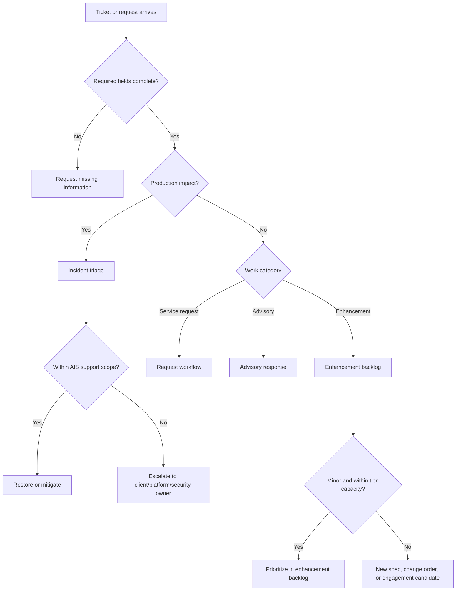

# Ops Playbook

Use this template as an account-specific operations handoff artifact after delivery, during hypercare exit, or when creating a support/enhancement retainer. Keep it copy/paste-ready for SharePoint, Teams, or account handoff docs. Do not implement or promise monitoring, ITSM, HubSpot, ServiceNow, Jira, Azure DevOps, or Teams connectors unless separately scoped.

| Field | Value |
| --- | --- |
| **Client / Account** | [Client name] |
| **Solution / Platform** | [Supported solution, product, or workstream] |
| **Date** | [YYYY-MM-DD] |
| **Version** | 1.0 |
| **Support Tier** | Base / Standard / Premium / TBD |
| **Service Owner** | [AIS owner] |
| **Client Owner** | [Client owner] |
| **Ticketing Channel** | [ServiceNow / Jira / Azure DevOps / GitHub / Teams / Email / TBD] |
| **Coverage Window** | [Business hours, timezone, holidays, extended coverage, TBD] |

---

## 1. Supported Scope

| Component / Area | Environment | Owner | Support Status | Notes |
| --- | --- | --- | --- | --- |
| [Application/API/job/model/report] | [Prod/UAT/Dev] | AIS / Client / Third party | In scope / Excluded / TBD | [Dependencies or constraints] |

### Out of Scope

- [Excluded system, environment, workflow, support type, or connector]
- [Pricing, rates, margins, or commercial approval outside this artifact]

---

## 2. Operational Signals and Baseline Alerts

| Signal Area | Baseline Signal | Alert / Review Trigger | Owner | Tool / Source | Gap |
| --- | --- | --- | --- | --- | --- |
| Availability | [Health endpoint, uptime, job completion] | [Threshold or TBD] | AIS / Client | [Tool or TBD] | [None / Gap] |
| Latency / performance | [P95, queue age, API response] | [Threshold or TBD] | AIS / Client | [Tool or TBD] | [None / Gap] |
| Data freshness / integrity | [Last successful load, row count, reconciliation] | [Threshold or TBD] | AIS / Client | [Tool or TBD] | [None / Gap] |
| Integration health | [Failed calls, retries, dead letters] | [Threshold or TBD] | AIS / Client | [Tool or TBD] | [None / Gap] |
| Cost / usage | [Azure cost, token usage, capacity] | [Threshold or TBD] | AIS / Client | [Tool or TBD] | [None / Gap] |
| AI/model quality | [Eval score, feedback, prompt/model errors] | [Threshold or TBD] | AIS / Client | [Tool or TBD] | [None / Gap] |
| Security / compliance | [Access failures, audit events, policy violations] | [Threshold or TBD] | AIS / Client | [Tool or TBD] | [None / Gap] |

Baseline guidance:

- Keep signal definitions tool-neutral unless a source names an approved tool.
- Treat missing alert thresholds as setup gaps, not invented commitments.
- Record who owns each alert response and who can approve production changes.

---

## 3. Ticket Taxonomy

| Category | Definition | Required Intake Fields | Target Handling | Exit Criteria |
| --- | --- | --- | --- | --- |
| Incident | Production-impacting interruption, degradation, failed job, security event, or data issue | Impact, priority, environment, time, affected users/data, logs/screenshots | Triage, restore, escalate, document root cause | Service restored or escalated to responsible owner |
| Service request | Standard access, config, deployment, data refresh, onboarding, or runbook task | Request type, approver, target date, environment | Fulfill through documented workflow | Request completed or rejected with reason |
| Advisory question | SME reachback, architecture, governance, or operational decision support | Question, context, deadline, decision owner | Answer within tier cadence | Recommendation documented |
| Enhancement request | New or changed behavior, workflow, report, integration, model/prompt, automation, or UX | Outcome, users, acceptance criteria, priority, sponsor | Triage into backlog; estimate and route | Accepted into support capacity, new spec/change order, or declined |
| New engagement candidate | Work that changes outcomes, users, systems, compliance, or team shape | Business outcome, sponsor, funding path, timing | Route to discovery/proposal/SOW | Opportunity owner identified |

---

## 4. Triage and Escalation Path



### Escalation Contacts

| Escalation Type | AIS Owner | Client Owner | Path | Notes |
| --- | --- | --- | --- | --- |
| Production outage | [Name/role] | [Name/role] | [Ticket/bridge/phone] | [Hours/timezone] |
| Security or privacy | [Name/role] | [Name/role] | [Path] | [Compliance constraints] |
| Data integrity | [Name/role] | [Name/role] | [Path] | [Data owner] |
| Platform / Azure / Fabric | [Name/role] | [Name/role] | [Path] | [Tenant/subscription owner] |
| Commercial scope | [Name/role] | [Name/role] | [Path] | [Change-order owner] |

---

## 5. Support Tier Mapping

| Tier Element | Current Decision | Notes / Gaps |
| --- | --- | --- |
| Selected tier | Base / Standard / Premium / TBD | [Rationale] |
| Response posture | [Business hours / extended / priority / TBD] | [Timezone and holidays] |
| Authoritative channel | [System/queue] | [Notification-only channels] |
| Staffing approach | [Fractional owner / support pod / named lead / offshore lane] | [Restrictions] |
| Incident handling | [Included handling] | [Exclusions] |
| Service request handling | [Included request types] | [Approval needs] |
| Advisory handling | [Office hours / scheduled / named SME] | [Limits] |
| Enhancement handling | [Backlog capacity / NTE / estimate only / TBD] | [Change threshold] |
| Reporting cadence | [Weekly / monthly / quarterly] | [Audience] |

---

## 6. Enhancement Intake and Backlog Workflow

### Required Enhancement Fields

Use these ServiceNow-style fields as connector-neutral guidance. This artifact
does not create or update ServiceNow, Jira, Azure DevOps, GitHub, HubSpot, or
Teams records.

| Field | Description |
| --- | --- |
| Request title | Short name |
| Business outcome | Why it matters |
| Affected users | Who benefits or is impacted |
| Current behavior | What happens now |
| Desired behavior | What should change |
| Acceptance criteria | How completion will be verified |
| Priority / urgency | Client priority and timing |
| Sponsor / approver | Client owner for tradeoffs |
| Risk / compliance | Any security, privacy, data, or audit concern |
| Estimated route | Support capacity / new spec / change order / new engagement |

### Routing Rules

| Condition | Route |
| --- | --- |
| Small, low-risk, source-aligned work within tier capacity | Enhancement backlog |
| Material design, new workflow, new integration, new data domain, or compliance impact | New spec or change order |
| New product outcome, platform, team shape, operating model, or funding path | New engagement candidate |
| Repeated service request | Automation candidate or backlog item |
| Repeated incident with shared root cause | Root-cause fix, alert tuning, runbook update, or new spec |

---

## 7. Reporting Cadence

| Cadence | Audience | Content | Owner |
| --- | --- | --- | --- |
| Weekly | [Team/account] | [Open incidents, blockers, planned releases, risks] | [Owner] |
| Monthly | [Account/client] | [Ticket counts by taxonomy, response posture, backlog, automation candidates] | [Owner] |
| Quarterly | [Executive/account] | [Trends, tier fit, roadmap candidates, capacity recommendation] | [Owner] |

### Standard Metrics

- Ticket count by category
- Open incidents and escalations
- Service requests completed
- Advisory questions answered
- Enhancement backlog added/completed/deferred
- Repeated incident/request themes
- Automation candidates identified
- Support tier fit: under capacity / healthy / stressed / needs change

---

## 8. Project-to-Ops Handoff Checklist

- [ ] Supported components, environments, repos, URLs, jobs, integrations, model endpoints, data stores, and owners listed
- [ ] Production and lower-environment access paths known
- [ ] Ticketing system, queue, required fields, priority model, and client approvers known
- [ ] Operational signal baseline and alert ownership documented
- [ ] Runbooks for deployment, rollback, restart/retry, known failures, backup/restore, and incident communication documented
- [ ] Known defects, deferred enhancements, technical debt, and warranty obligations listed
- [ ] Regression, smoke, or eval evidence expectations defined for bug fixes and enhancements
- [ ] Spec, documentation, and runbook update ownership defined for behavior or procedure changes
- [ ] Security, privacy, audit, data retention, and offshore restrictions documented
- [ ] Reporting cadence, service owner, escalation path, and tier recommendation approved
- [ ] Enhancement backlog workflow and new engagement threshold documented
- [ ] HubSpot follow-on summary reviewed by account owner if needed

---

## 9. Minimum Viable Ops Mode

Use this section when the client needs a small retainer or limited-budget support path.

| Required Element | Decision |
| --- | --- |
| Named AIS owner | [Name/role] |
| Intake channel | [System/queue] |
| Coverage | [Business hours/timezone] |
| Monthly checkpoint | [Date/cadence] |
| Supported components | [List/TBD] |
| Known alerts/signals | [List/TBD] |
| Explicit exclusions | [24x7, SLA penalties, client Tier 1, connector work, production ownership, etc.] |
| Escalation rule | [Security/data/outage/commercial trigger] |

---

## 10. HubSpot-Ready Follow-On Summary

```
AIS recommends a [Base/Standard/Premium] Ops Continuity Package for [client/solution] to provide [incident/request/advisory/enhancement] support after delivery. The package establishes a named intake path, support taxonomy, tiered response posture, enhancement backlog workflow, reporting cadence, and project-to-ops handoff checklist. Pricing and final commercial terms remain pending business review.
```

```
Recommended tier: [Tier]. Rationale: [production criticality/change demand/support channel/offshore eligibility/onboarding volume]. Open decisions: [timezone, ticketing, client owner, enhancement threshold, offshore mode, compliance/data constraints].
```

---

## 11. Open Questions and Gaps

| # | Question / Gap | Impact | Owner | Target Date |
| --- | --- | --- | --- | --- |
| 1 | [Question or gap] | [Tier, support readiness, escalation, enhancement governance, or SOW language] | AIS / Client | [Date/TBD] |
